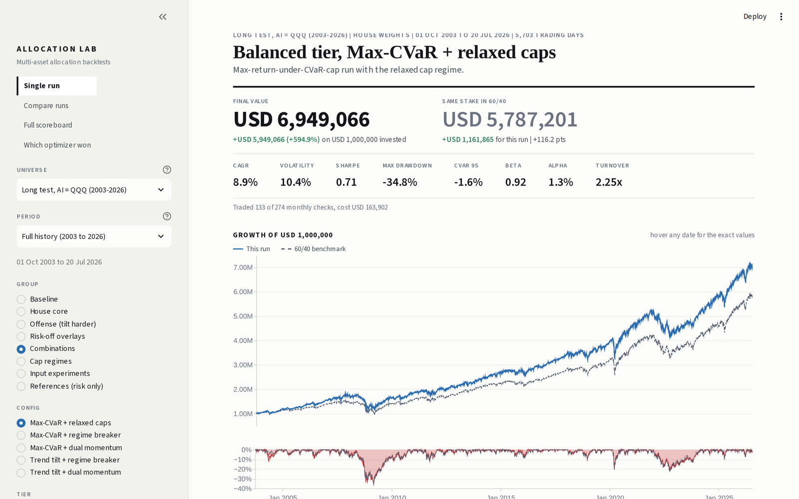
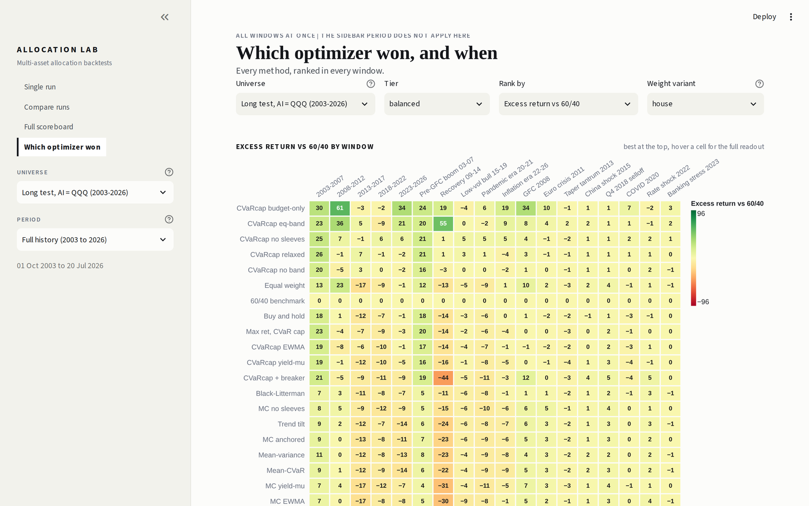
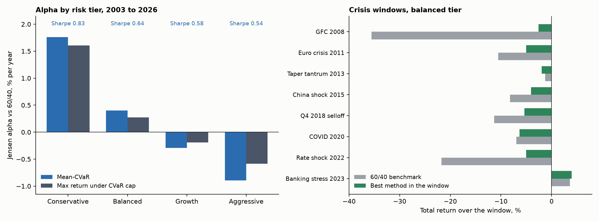

# Portfolio Allocation Engine

Multi-asset portfolio construction, walk-forward tested across 23 years and 40 allocation methods.

**Live dashboard (Allocation Lab):** https://allocation-lab.streamlit.app



A risk-profiled allocation engine for a 14-sleeve ETF universe, and a research lab that runs every optimiser through the same walk-forward protocol and compares it to a passive 60/40 over 23 years.

## What is here

- An allocation engine. Four risk tiers, each a strategic weight ladder with hard concentration caps, solved monthly by a mean-CVaR linear program and its dual (maximum return under a tail-risk budget).
- A walk-forward backtester. One pass, never re-fitted, with transaction costs and tolerance-band rebalancing. Sub-periods and crisis windows are cut from the single out-of-sample curve afterwards, so no sub-period result is fitted.
- A research lab. 40 methods on three universes: the ETF book on its actual instruments (2022 to 2026), and two long-history reconstructions back to 2003 that cover the 2008 crisis, the 2011 euro crisis, the 2022 rate shock and five calendar blocks.
- Scoring. Every configuration is counted as a trial and the best Sharpe is deflated for the number of tries. Drawdowns are compared against a passive book at the same exposure rather than against 100 percent buy-and-hold.
- A dashboard. Every run, window, holding and trade is browsable. The tables below are built from the same store.

## Live dashboard

The dashboard reads a precomputed store; every control recomputes from it.

| Control | What it changes |
| --- | --- |
| Universe | ETF universe (2022 to 2026), or one of the two long tests (2003 to 2026) |
| Period | Full history, five calendar blocks, eight crisis windows. Every number and chart on the page follows this filter |
| Group and config | Baseline, house core, offense, risk-off overlays, combinations, cap regimes, input experiments, risk-only references |
| Tier | Conservative, balanced, growth, aggressive |
| Weight variant | The policy ladder and four stressed versions of it |

Four views: **Single run** (metrics, growth and drawdown chart, allocation, P&L by sleeve, every trade), **Compare runs**, **Full scoreboard** (every configuration, deflated Sharpe included) and **Which optimizer won** (every method ranked in every window).



## Findings



**Risk-adjusted value concentrates in the low-risk tiers.** On the conservative tier, mean-CVaR reaches a Sharpe of 0.83 against 0.62 for the 60/40 benchmark, with a maximum drawdown of -14 percent against -36 percent and a Jensen alpha of +1.8 percent a year. Alpha then falls monotonically through the tiers and turns negative on the growth and aggressive profiles.

**The aggressive tier's outperformance is explained by its beta.** The aggressive book finishes 23 years at +713 percent against +479 percent for the 60/40. Its beta is 1.41 and its alpha is -0.6 percent. A 60/40 simply levered to the same beta finishes higher (USD 9.38m against 8.06m on a 1m stake), with a better Sharpe (0.62 against 0.56) and a smaller drawdown.

**The overlays protect in crises and lag in calm markets.** In seven of the eight crisis windows the best investable method beats the benchmark. Dual momentum holds the 2008 crisis to -2.6 percent against -35.6 percent for the 60/40. In 2022, when equities and bonds fell together, the trend-plus-momentum combination loses 5.0 percent against 21.7 percent, because the momentum filter exits both legs. In the calm calendar blocks the 60/40 wins two of five, and the rest are decided by a few points.

**Most of the gain over the 60/40 comes from the wider universe rather than from the optimiser.** Equal weight across the 14 sleeves, with no estimation at all, reaches a Sharpe of 0.75. The risk-only methods that ignore expected returns entirely (maximum diversification 0.96, risk parity 0.89, HRP 0.83) sit at the top of the scoreboard, because they carry no estimation error on the mean. This is consistent with DeMiguel, Garlappi and Uppal (2009).

**On the four-year ETF universe, no configuration reaches statistical significance.** With 286 configurations tried and a cross-sectional Sharpe dispersion of 0.20, the luck threshold is a Sharpe of 0.57. The best run scores exactly 0.57 and a deflated Sharpe of 56 percent against the 95 percent required. The 60/40 itself fails the same gate. Four years of history is too short to establish significance after 286 trials; the long tests exist for that reason.

## Method

### Universe and tiers

Fifteen sleeves in four buckets, each mapped to a US-listed ETF. Private markets carries no proxy and sits at zero in every tier, so the engine works on the 14 funded sleeves.

| Bucket | Sleeves | Proxies |
| --- | --- | --- |
| Equity | Europe, US, developed Asia-Pacific, emerging, thematic AI | IEUR, IVV, EWJ, IEMG, AIQ |
| Fixed income | Government, IG credit, inflation-linked, high yield, EM debt | GOVT, LQD, TIP, HYG, EMB |
| Alternatives | Gold, liquid alternatives, real assets | GLD, DBMF, IGF |
| Cash | Money market | BIL |

The ETF universe only becomes complete on 9 May 2019, when the managed-futures sleeve (DBMF) launched, and the engine needs 756 trading days before its first decision, so that backtest starts in mid-2022. The two long tests rebuild the same sleeves from index mutual funds, gold futures and the 13-week T-bill back to 2003; they differ only in what stands in for the AI sleeve (QQQ, or an equal-weight AAPL, MSFT, AMZN basket). The substitution does not drive the conclusions: rank correlation between the two long tests is 0.86 to 0.996 across the 19 windows, with the same winner in 17 of them.

Four tiers, each a strategic weight ladder. The equity band is the tier's risk profile: 0 to 30 percent (conservative), 50 to 55 (balanced), 68 to 75 (growth), 82 to 92 (aggressive).

### Constraints

All constraints enter the optimiser as hard cvxpy constraints, never as an after-the-fact filter. The solver cannot return a non-compliant book; if none exists it reports which cap binds.

```
long-only, fully invested          sum(w) = 1, w >= 0
equity band per tier               lo <= sum(w_equity) <= hi
emerging equity                    <= 20 percent of the equity sleeve
thematic AI                        <= 10 percent of the equity sleeve
gold                               between 3 and 5 percent
high yield + EM debt               <= 8 percent, 0 on the aggressive tier
tactical band                      |w - w_strategic| <= 10 points
```

These are concentration and profile limits, a house policy. The regulatory framework the design follows (diversification, eligible assets, daily liquidity) is documented in the config but is not a constraint the solver reads.

### Estimation

Every decision uses only returns up to the decision date, on a rolling 756-day window.

- **Covariance:** Ledoit-Wolf shrinkage toward a structured target. The sample covariance is ill-conditioned with 14 assets on 756 days; its largest eigenvalues are overstated, its smallest understated, and the optimiser inverts it.
- **Expected returns:** Bayes-Stein (Jorion) shrinkage of the sample means toward a common grand mean. The standard error of a three-year mean return is roughly 11 percentage points, larger than most of the means themselves. Shrinkage moves the balanced tier's return target from 5.60 to 3.89 percent.
- **Tail scenarios:** the 756 daily return vectors are the scenarios the CVaR is computed on, with no fitted distribution in between.

### Optimisers

| Family | Method | What it solves |
| --- | --- | --- |
| Baseline | Buy and hold | Holds the tier's strategic weights, rebalanced back on drift. The policy portfolio every active method must beat |
| House core | Mean-CVaR | Minimise the 95 percent CVaR subject to earning at least the strategic portfolio's expected return, inside every cap. Linear program via Rockafellar and Uryasev |
| Offense | Max return under CVaR cap | The dual: maximise expected return subject to CVaR no worse than the strategic portfolio's own. A risk budget in the strict sense |
| Offense | Mean-variance | The Markowitz twin of the house method, same caps. Measures what replacing variance with CVaR buys |
| Offense | Trend tilt | Nudge expected returns toward 12-1 momentum winners (z-scored, capped at 2 sigma, 2 percent strength), then solve inside the caps |
| Offense | Black-Litterman, momentum views | Point-in-time momentum z-scores as views on the equilibrium prior, then mean-CVaR on the posterior |
| Offense | Mean-CVaR, anchored | A ridge pull toward the strategic weights. Lower turnover |
| Risk-off overlay | Vol target | Scale the book to a 10 percent ex-ante volatility, park the rest in cash. Only ever de-risks |
| Risk-off overlay | Regime breaker | When the equity composite is below its 200-day average, move half the equity weight into cash and gold |
| Risk-off overlay | Dual momentum | Sell any sleeve whose 12-1 momentum is below cash's own, entirely to cash |
| Combinations | Offense + overlay | Tilt harder, then de-risk on top |
| References | Risk parity, HRP, min variance, max Sharpe, max diversification, equal weight, inverse vol | Tier-free risk-structure methods, run once, with no expected-return input except max Sharpe |

The CVaR program, on S scenarios at confidence beta, introduces an auxiliary threshold zeta and one slack per scenario:

```
minimise    zeta + 1 / ((1 - beta) S) * sum(z_s)
subject to  z_s >= -(w . r_s) - zeta,   z_s >= 0
            mu . w >= mu . w_strategic
            tier constraints
```

At the optimum zeta equals the VaR, and the objective equals the CVaR. Both constraints are linear, so the whole problem is a linear program solved exactly.

### Walk-forward protocol

```
wait 756 trading days of history
on the first trading day of each month:
    estimate mu and Sigma on returns up to today
    solve the optimiser for target weights
    if the largest gap between current and target weight exceeds 5 points:
        trade every sleeve to target, pay 10 bps on the volume traded
    else:
        leave the book to drift
```

One pass per universe, tier and method. The equity curve is produced once and sliced afterwards into five calendar blocks and eight crisis windows, anchored to real peaks and troughs. The benchmark goes through the same loop with a constant target, so it pays the same costs and obeys the same band.

### Validation

- **Deflated Sharpe ratio** (Bailey and Lopez de Prado). The dashboard's Confidence column: the probability that a run's true Sharpe is above zero, given the number of configurations tried, the dispersion of Sharpe across them, the track length, and the skew and kurtosis of returns. It is shown only on full history; a multiple-testing correction built over the whole sample has no meaning on a sub-window.
- **Exposure-matched comparison.** A run that is 43 percent invested will show a smaller drawdown than a fully invested benchmark whatever its skill. The relevant comparison is a passive book at the same average exposure, or the benchmark levered to the same beta.
- **Attribution reconciles.** Gross sleeve P&L minus recorded costs equals the equity curve, for every run.

## Results

Long test (AI = QQQ), full history October 2003 to July 2026, house weights.

### By tier

| Configuration | CAGR | Vol | Sharpe | Max DD | Beta | Alpha |
| --- | ---: | ---: | ---: | ---: | ---: | ---: |
| 60/40 benchmark | 8.07% | 10.77% | 0.62 | -36.3% | 1.00 | 0.00% |
| Dual momentum, conservative | 4.67% | 3.29% | 0.88 | -7.9% | 0.14 | +1.95% |
| Mean-CVaR, conservative | 5.05% | 3.95% | 0.83 | -14.2% | 0.23 | +1.76% |
| Max return under CVaR cap, conservative | 6.04% | 5.65% | 0.76 | -21.8% | 0.41 | +1.61% |
| Mean-CVaR, balanced | 7.25% | 8.85% | 0.64 | -32.4% | 0.80 | +0.40% |
| Max return under CVaR cap, balanced | 7.91% | 10.30% | 0.63 | -37.4% | 0.93 | +0.27% |
| Mean-CVaR, growth | 8.28% | 12.09% | 0.58 | -42.4% | 1.10 | -0.29% |
| Max return under CVaR cap, growth | 9.01% | 13.30% | 0.59 | -45.8% | 1.21 | -0.19% |
| Mean-CVaR, aggressive | 8.95% | 14.74% | 0.54 | -50.1% | 1.33 | -0.89% |
| Max return under CVaR cap, aggressive | 9.70% | 15.56% | 0.56 | -51.3% | 1.41 | -0.59% |

### Risk-only references on the same 14 sleeves

| Method | CAGR | Vol | Sharpe | Max DD | Alpha |
| --- | ---: | ---: | ---: | ---: | ---: |
| Max diversification | 5.58% | 3.97% | 0.96 | -14.6% | +2.18% |
| Risk parity | 5.91% | 4.66% | 0.89 | -19.1% | +1.85% |
| Inverse volatility | 6.14% | 5.24% | 0.84 | -22.7% | +1.56% |
| Hierarchical risk parity | 4.59% | 3.41% | 0.83 | -16.8% | +1.76% |
| Equal weight | 8.35% | 8.98% | 0.75 | -29.6% | +1.44% |
| Min variance | 3.87% | 2.91% | 0.73 | -13.2% | +1.35% |

The best Sharpe on the full scoreboard is the maximum over 136 correlated runs, and the dashboard flags it as such next to the number.

### Crisis windows, balanced tier, investable menu

| Window | Best method | Return | 60/40 | Gap |
| --- | --- | ---: | ---: | ---: |
| GFC 2008 | Dual momentum | -2.6% | -35.6% | +33.0 pts |
| Rate shock 2022 | Trend tilt + dual momentum | -5.0% | -21.7% | +16.7 pts |
| Q4 2018 selloff | Regime breaker | -5.3% | -11.3% | +6.0 pts |
| Euro crisis 2011 | Vol target | -5.1% | -10.5% | +5.5 pts |
| China shock 2015 | Trend tilt + regime breaker | -4.1% | -8.2% | +4.1 pts |
| COVID 2020 | Max return under CVaR cap, relaxed caps | -6.3% | -7.0% | +0.7 pts |
| Banking stress 2023 | Max return under CVaR cap | +4.0% | +3.6% | +0.3 pts |
| Taper tantrum 2013 | Max return under CVaR cap, relaxed caps | -2.0% | -1.3% | -0.7 pts |

The winner changes with the window. Selecting the best method per window after the fact is itself a form of overfitting, which the deflated Sharpe on the full scoreboard accounts for.

## Experiments

### What the caps cost

The house method was re-run under six constraint layers, from the full policy down to long-only. Removing every cap lifts the aggressive tier to +2,421 percent over 23 years at a Sharpe of 0.89, and the book ends up holding as much as 93 percent in a single sleeve, with a median of 48 percent. On the four-year ETF universe the same uncapped configuration delivers a Sharpe of 0.32, a -32 percent drawdown and 6.2x annual turnover. The gap between the capped and uncapped runs is the measured cost of the concentration limits.

### Input experiments

Each changes one estimator and nothing else, scored on the window every variant shares (2011 to 2026, balanced tier, both long universes). Parameters were fixed before any result was seen.

| Experiment | Change | Sharpe | Turnover | Verdict |
| --- | --- | ---: | ---: | --- |
| Base | 3-year window | 0.69 | 1.26x | reference |
| 5-year window | longer lookback | 0.72 | 0.98x | adopted; confirmed on the second universe (0.71 to 0.76) |
| 10-year window | longer still | 0.67 | 0.46x | the gain reverses; staleness overtakes sampling error between 5 and 10 years |
| EWMA scenarios | recent days weighted, lambda 0.97 | 0.68 | 3.93x | rejected; about 66 effective days, the tail rests on three observations, crises no better |
| Yield-anchored mu | cash rate plus shrunk long-run premia | 0.64 | 0.67x | rejected at 10 bps; halved turnover could flip it at real-world costs |

On this data the autocorrelation of daily returns is -0.075, of absolute returns +0.270, of monthly turbulence +0.660: volatility persists, the sign of returns does not. In 2022 the three-year window still estimated the stock-bond correlation at -0.38 while the realised figure was +0.14.

## Limitations

- The ETF universe spans four years, which is not enough to establish significance after 286 trials.
- The long tests use index mutual funds as proxies. The substitution is tested above, but they are not the ETFs a portfolio would hold.
- Costs are a flat 10 bps per unit traded. That is optimistic for the least liquid sleeves.
- Overlays act after the solver, so they can move a weight past a policy cap; the regime breaker pushes gold above its 5 percent ceiling when it fires. A production version would re-project the result into the constraint set, or de-risk with index futures instead of moving physical weights.
- Concentration is enforced at the sleeve level. Two sleeves holding the same mega-caps are not measured as one exposure.
- No derivatives are traded. The vol target and momentum overlays are the conceptual equivalent of an overlay, implemented by changing weights.

## Repository

```
engine/         estimators, constraints, optimisers, overlays, allocate()
backtest/       walk-forward loop, benchmark, metrics (incl. deflated Sharpe), the robustness lab
data_layer/     price download (yfinance), returns, quality checks, store build
reporting/      dashboard, periods, charts, tearsheets
config/         universe.yaml: sleeves, proxies, tiers, caps, weight variants
data/           store.duckdb (every curve, metric, trade and attribution), long-history prices
docs/img/       figures used above
streamlit_app.py
```

## Running locally

Dashboard only, from the shipped store:

```
pip install -r requirements.txt
streamlit run streamlit_app.py
```

Rebuild the data and re-run the engine and the lab:

```
pip install -r requirements-engine.txt
python -m data_layer.build           # prices, returns, quality report
ALLOC_LAB=1 python -m backtest.run   # walk-forward on the ETF universe, every variant
python -m backtest.robustness        # the long tests, every method and tier
python -m engine.run                 # point-in-time allocation at the latest date
```

The lab takes about 40 minutes on a laptop; the 10-year-window variant solves programs with 2,520 scenario rows.

## References

- Rockafellar, R.T. and Uryasev, S. (2000). Optimization of conditional value-at-risk. *Journal of Risk*.
- Ledoit, O. and Wolf, M. (2004). A well-conditioned estimator for large-dimensional covariance matrices. *Journal of Multivariate Analysis*.
- Jorion, P. (1986). Bayes-Stein estimation for portfolio analysis. *Journal of Financial and Quantitative Analysis*.
- Black, F. and Litterman, R. (1992). Global portfolio optimization. *Financial Analysts Journal*.
- Bailey, D.H. and Lopez de Prado, M. (2014). The deflated Sharpe ratio. *Journal of Portfolio Management*.
- DeMiguel, V., Garlappi, L. and Uppal, R. (2009). Optimal versus naive diversification. *Review of Financial Studies*.
- Lopez de Prado, M. (2016). Building diversified portfolios that outperform out of sample. *Journal of Portfolio Management*.
- Antonacci, G. (2014). *Dual Momentum Investing*. McGraw-Hill.
- Moreira, A. and Muir, T. (2017). Volatility-managed portfolios. *Journal of Finance*.
